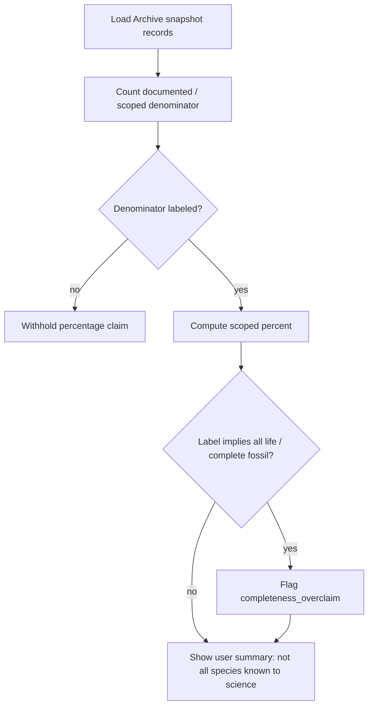

# Wave008 — Activity: coverage without completeness claim

```mermaid
flowchart TD
  A[Load Archive snapshot records] --> B[Count documented / scoped denominator]
  B --> C{Denominator labeled?}
  C -->|no| D[Withhold percentage claim]
  C -->|yes| E[Compute scoped percent]
  E --> F{Label implies all life / complete fossil?}
  F -->|yes| G[Flag completeness_overclaim]
  F -->|no| H[Show user summary: not all species known to science]
  G --> H
```
