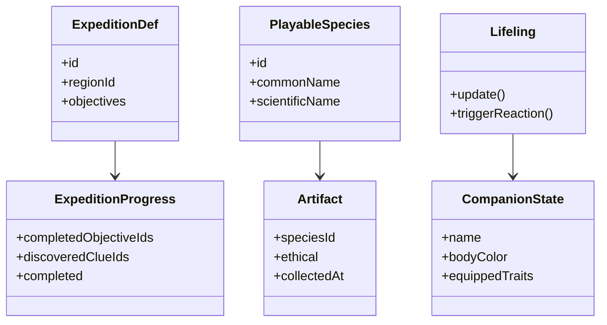

# Class — domain (current)

```mermaid
classDiagram
  class ExpeditionDef {
    +id
    +regionId
    +objectives
  }
  class ExpeditionProgress {
    +completedObjectiveIds
    +discoveredClueIds
    +completed
  }
  class PlayableSpecies {
    +id
    +commonName
    +scientificName
  }
  class Artifact {
    +speciesId
    +ethical
    +collectedAt
  }
  class Lifeling {
    +update()
    +triggerReaction()
  }
  class CompanionState {
    +name
    +bodyColor
    +equippedTraits
  }
  ExpeditionDef --> ExpeditionProgress
  PlayableSpecies --> Artifact
  Lifeling --> CompanionState
```

`src/systems/expeditionSystem.ts`, `src/systems/artifactSystem.ts`, `src/game/companion.ts`.
