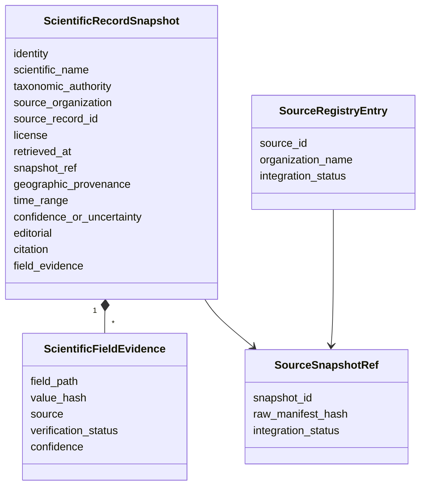

# Wave008 — Class / domain: ScientificRecord

```mermaid
classDiagram
  class ScientificRecordSnapshot {
    identity
    scientific_name
    taxonomic_authority
    source_organization
    source_record_id
    license
    retrieved_at
    snapshot_ref
    geographic_provenance
    time_range
    confidence_or_uncertainty
    editorial
    citation
    field_evidence
  }
  class ScientificFieldEvidence {
    field_path
    value_hash
    source
    verification_status
    confidence
  }
  class SourceSnapshotRef {
    snapshot_id
    raw_manifest_hash
    integration_status
  }
  class SourceRegistryEntry {
    source_id
    organization_name
    integration_status
  }
  ScientificRecordSnapshot "1" *-- "*" ScientificFieldEvidence
  ScientificRecordSnapshot --> SourceSnapshotRef
  SourceRegistryEntry --> SourceSnapshotRef
```
