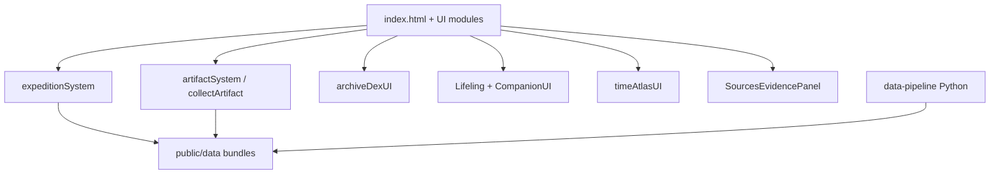

# Component — current

```mermaid
flowchart TB
  UI[index.html + UI modules]
  EXP[expeditionSystem]
  ART[artifactSystem / collectArtifact]
  DEX[archiveDexUI]
  LIFE[Lifeling + CompanionUI]
  TIME[timeAtlasUI]
  EV[SourcesEvidencePanel]
  DATA[public/data bundles]
  PIPE[data-pipeline Python]
  UI --> EXP
  UI --> ART
  UI --> DEX
  UI --> LIFE
  UI --> TIME
  UI --> EV
  EXP --> DATA
  ART --> DATA
  PIPE --> DATA
```
