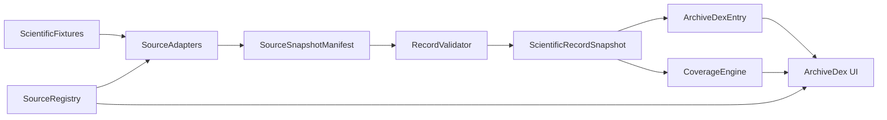

# Wave008 — Component: ArchiveDex scientific record stack

Components:
- ArchiveDex UI consumes ScientificRecordSnapshot via ArchiveDexEntry.scientificRecord
- Source adapters (fixture/HTTP stub) produce snapshots with explicit integration_status
- Coverage engine labels denominator; forbids completeness overclaim
- Field-level ScientificFieldEvidence binds value hashes to provenance
