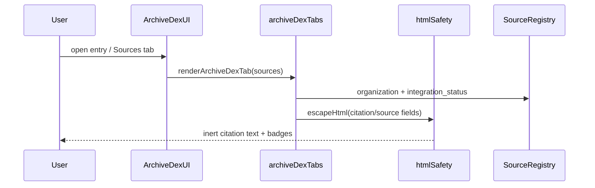

# Wave008 — Sequence: user opens Sources & citation

```mermaid
sequenceDiagram
  participant User
  participant DexUI as ArchiveDexUI
  participant Tabs as archiveDexTabs
  participant Safe as htmlSafety
  participant Reg as SourceRegistry
  User->>DexUI: open entry / Sources tab
  DexUI->>Tabs: renderArchiveDexTab(sources)
  Tabs->>Reg: organization + integration_status
  Tabs->>Safe: escapeHtml(citation/source fields)
  Safe-->>User: inert citation text + badges
```
