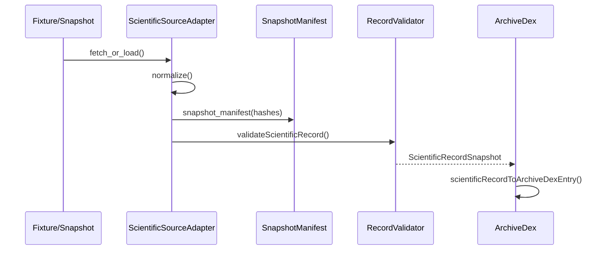

# Wave008 — Sequence: snapshot ingest → ArchiveDex

```mermaid
sequenceDiagram
  participant Fix as Fixture/Snapshot
  participant Adp as ScientificSourceAdapter
  participant Man as SnapshotManifest
  participant Val as RecordValidator
  participant Dex as ArchiveDex
  Fix->>Adp: fetch_or_load()
  Adp->>Adp: normalize()
  Adp->>Man: snapshot_manifest(hashes)
  Adp->>Val: validateScientificRecord()
  Val-->>Dex: ScientificRecordSnapshot
  Dex->>Dex: scientificRecordToArchiveDexEntry()
```
