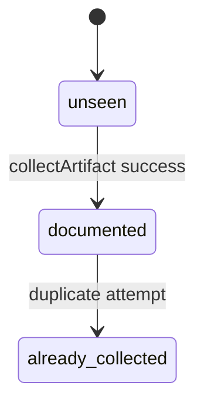
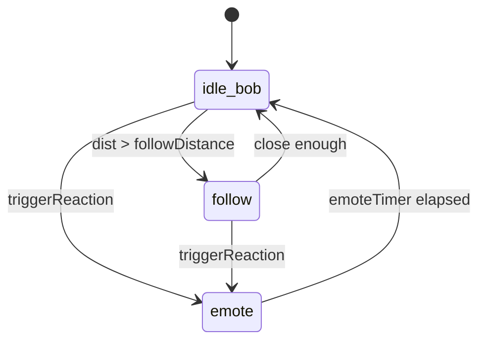

# State machine — artifact / Lifeling (current)

Artifact collection:

Lifeling runtime (derived from `Lifeling.update` / emote timers — not a formal enum in code):

Generated / sample biology must remain labeled; never “verified science.”
