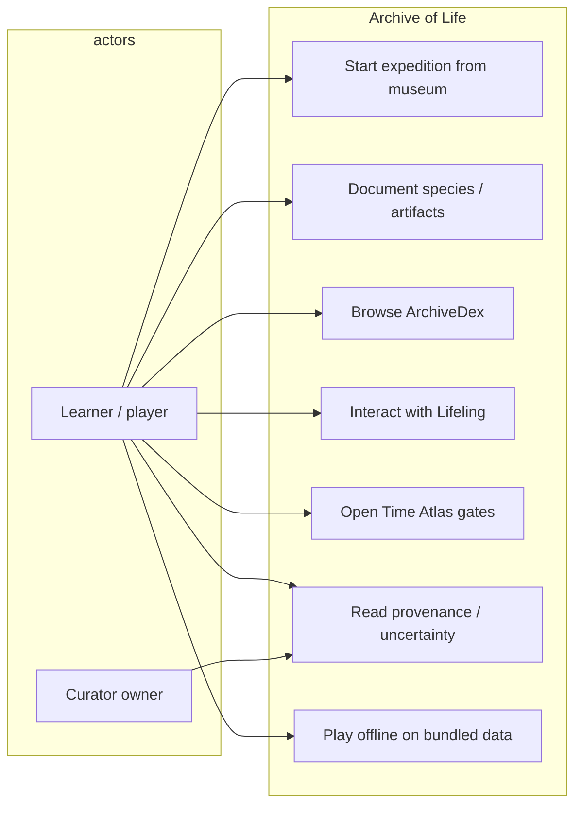

# Use case — current

```mermaid
flowchart LR
  subgraph actors
    L[Learner / player]
    C[Curator owner]
  end
  subgraph game [Archive of Life]
    UC1[Start expedition from museum]
    UC2[Document species / artifacts]
    UC3[Browse ArchiveDex]
    UC4[Interact with Lifeling]
    UC5[Open Time Atlas gates]
    UC6[Read provenance / uncertainty]
    UC7[Play offline on bundled data]
  end
  L --> UC1
  L --> UC2
  L --> UC3
  L --> UC4
  L --> UC5
  L --> UC6
  L --> UC7
  C --> UC6
```
